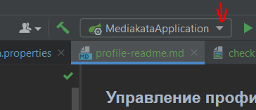
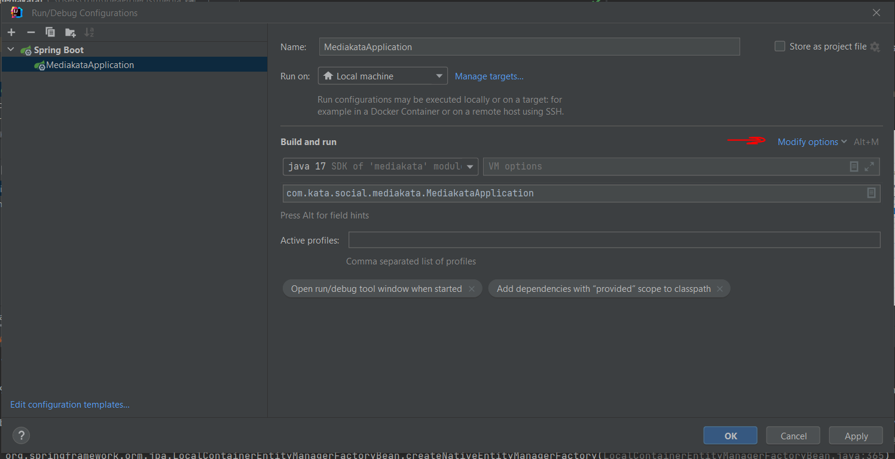
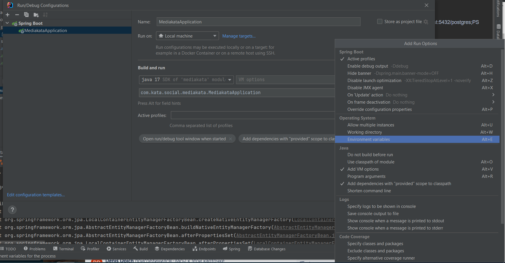
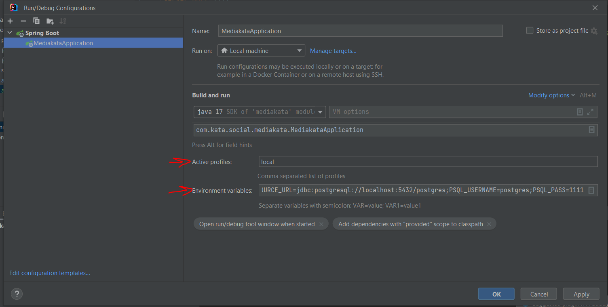

### Управление профилями

1. Нажмите стрелочку в поле  **Run Configuration** , нажмите кнопку **Edit Configuration** 

2. Выберите опцию **Modify Options**

3. В выплывающем меню выберите настройку **Environment variables** и **Active profiles** (если не выбрана по умолчанию)
 
4. В появившемся поле необходимо вписать значения переменных SPRING_DATASOURCE_URL, PSQL_USERNAME, PSQL_PASS - 
 URL, логин и пароль локального сервера, а так же вписать в поле **Active profiles** значение local

Пример:
  **SPRING_DATASOURCE_URL**=jdbc:postgresql://localhost:5432/postgres;**PSQL_USERNAME**=postgres;**PSQL_PASS**=1111
