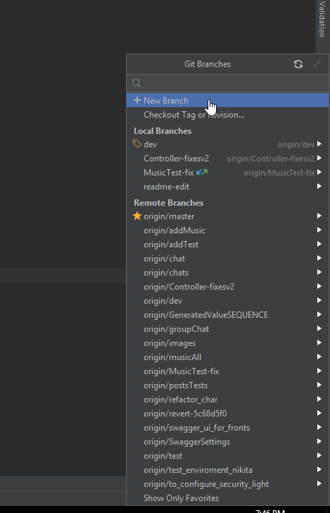
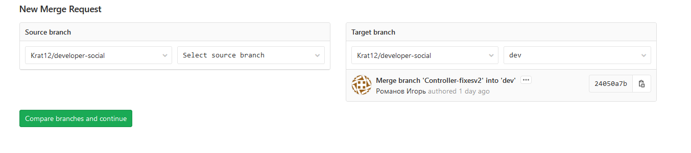

# Документация Media Social Kata
## Работа с git
### Клонирование проекта

1. На странице репозитория убедитесь, что выбрана ветка **dev** (1), нажмите кнопку **Clone** (2), скопируйте ссылку (3).

2. Откройте **Intellij IDEA**, нажмите **Get from version control** на экране приветствия, либо **VCS | Git | Clone...** в меню.

3. Вставьте скопированную ссылку в строку **URL**, нажмите **Clone**.

### Перед внесением изменений в код
Создайте новую ветку в git-репозитории и работайте в ней. Для этого:
1. Нажмите на текущую ветку **dev** в правом нижнем углу.

2. Выберите **New branch**.

3. Введите название своей новой ветки (на ваше усмотрение) и нажмите **Create**.

### Добавление своего кода в общий репозиторий. Git push.

Прежде чем создать merge request вам необходимо подготовить вашу ветку к отправке в общий репозиторий.

1. Нажмите на текущую ветку в правом нижнем углу. Выберите опцию **dev | update**. 
Таким образом вы скачаете в свою локальную ветку **dev** все коммиты которые были замержены, 
пока вы работали в своей ветке.

2. Убедитесь, что в данный момент активна ваша рабочая ветка (занчек ярлыка слева от имени, как у ветки my-branch на скриншоте).
Выберите опцию **dev | Merge into Current**. Таким образом вы добавите все изменения из ветки **dev** в вашу ветку. При возникновении конфликтов разрешите их.

3. ---**ВАЖНО**--- Убедитесь что проект собирается и запускается.

4. Выберите вашу ветку и нажмите на **Push...** чтобы добавить её в общий репозиторий.

### Создание merge request

1. Создайте новый merge request. В качестве **Source branch** выберите свою ветку, **Target branch** - **dev**.

2. Проверьте данные, допишите комментарии при необходимости. Обратите внимание на опцию **Delete source branch when merge request is accepted**.
Завершите создание реквеста, приложите ссылку на него в карточку таска на Trello.

### Управление профилями

1. Нажмите стрелочку в поле  **Run Configuration** , нажмите кнопку **Edit Configuration**

2. Выберите опцию **Modify Options**

3. В выплывающем меню выберите настройку **Environment variables** и **Active profiles** (если не выбрана по умолчанию)
   
4. В появившемся поле необходимо вписать значения переменных DB_HOST, DB_PORT, DB_NAME, PSQL_USERNAME, PSQL_PASS  - 
   URL, логин и пароль локального сервера, а так же вписать в поле **Active profiles** значение local

Пример:
DB_HOST=localhost;DB_PORT=5432;DB_NAME=postgres;PSQL_USERNAME=postgres;PSQL_PASS=1111

### Тестирование

Использование класса AbstractSpringTest

Для использования класса AbstractSpringTest нужно скачать Docker.
Для работы докера в Windows нужно дополнительно установить WSL.

В классе Postgres в пакете initializer eсть PostgreSQLContainer который загружает в докер изображение БД.
Также в этом классе есть статический вложенный класс Initializer, который подменяет при тестах spring datasource: url, username, password.

При тестировании своего класса с тестовыми данными используйте аннотацию @Sql и в ней введите путь до файла sql c тестовыми данными. Ex. @Sql("/sql/data.sql")

Если мы хотим использовать другую БД, то нам нужно использовать другое изображение БД в
докере и указать этот класс в ContextConfiguration в классе AbstractSpringTest.
